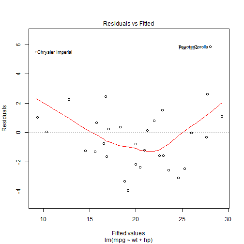
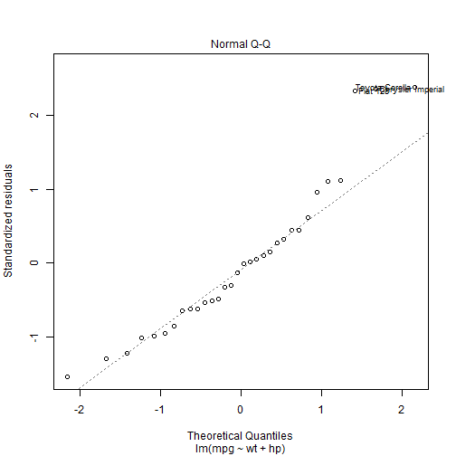
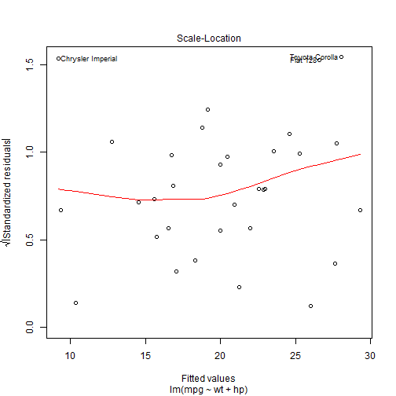
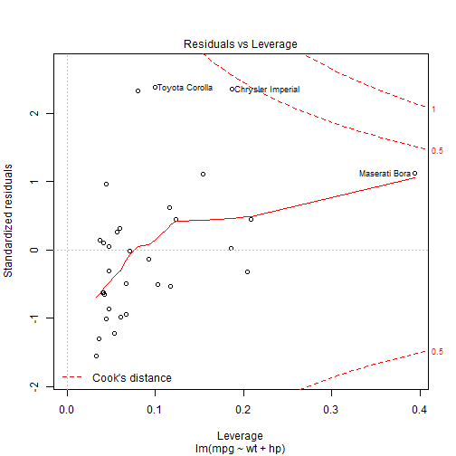

## Dataset

The dataset I've used to make the shiny app is mtcars. You can see a summary of dataset.


```
##       mpg        cyl         disp             hp             drat      
##  Min.   :10.40   4:11   Min.   : 71.1   Min.   : 52.0   Min.   :2.760  
##  1st Qu.:15.43   6: 7   1st Qu.:120.8   1st Qu.: 96.5   1st Qu.:3.080  
##  Median :19.20   8:14   Median :196.3   Median :123.0   Median :3.695  
##  Mean   :20.09          Mean   :230.7   Mean   :146.7   Mean   :3.597  
##  3rd Qu.:22.80          3rd Qu.:326.0   3rd Qu.:180.0   3rd Qu.:3.920  
##  Max.   :33.90          Max.   :472.0   Max.   :335.0   Max.   :4.930  
##        wt             qsec       vs     am     gear   carb  
##  Min.   :1.513   Min.   :14.50   0:18   0:19   3:15   1: 7  
##  1st Qu.:2.581   1st Qu.:16.89   1:14   1:13   4:12   2:10  
##  Median :3.325   Median :17.71                 5: 5   3: 3  
##  Mean   :3.217   Mean   :17.85                        4:10  
##  3rd Qu.:3.610   3rd Qu.:18.90                        6: 1  
##  Max.   :5.424   Max.   :22.90                        8: 1
```

--- .class #id 

## Model

I've made a linear model to predict fuel consumption in miles per gallon with weight in lb and power in hp. The summary of the model is:

```r
fit <- lm(mpg ~ wt + hp, data=mtcars)
summary(fit)$coefficients
```

```
##                Estimate Std. Error   t value     Pr(>|t|)
## (Intercept) 37.22727012 1.59878754 23.284689 2.565459e-20
## wt          -3.87783074 0.63273349 -6.128695 1.119647e-06
## hp          -0.03177295 0.00902971 -3.518712 1.451229e-03
```


--- .class #id 

## R squared

R squared is:

```r
summary(fit)$r.squared
```

```
## [1] 0.8267855
```

--- .class #id 

## Residuals

Plots of the residuals are:

```r
plot(fit)
```

    
